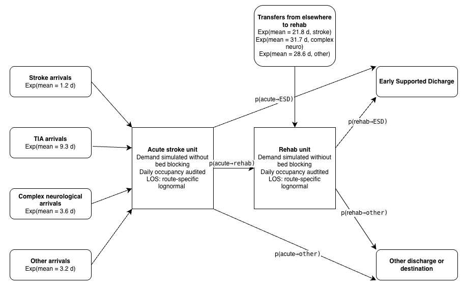
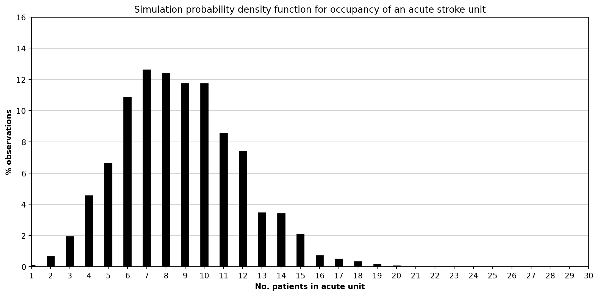
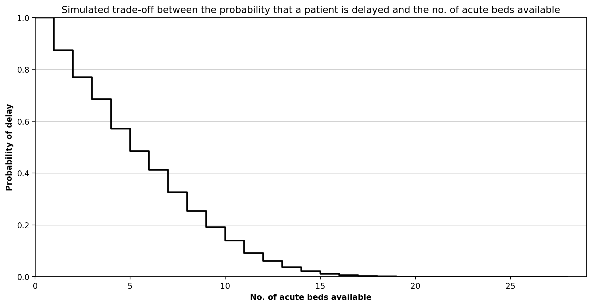

# HDPM_097 Discrete Event Simulation Project

**Authors:** NA, NB, LB

[Github repository](https://github.com/nyberry/HDPM097)

## Abstract

Discrete-event simulation (DES) models in healthcare research are rarely published with accompanying code, making independent recreation from text descriptions an important test of reproducibility. This study recreated the stroke pathway capacity planning model reported by Monks et al. [1] in Python using SimPy, following an iterative workflow that combined manual model design with large language model (LLM) assisted code generation using Gemini and Codex. The recreated models closely reproduced the published p(delay) estimates for the current-admissions and increased-demand scenarios across both acute and rehabilitation beds. Agreement was weaker for policy-dependent scenarios such as bed pooling and ring-fencing, where the original implementation could not be fully inferred from the text. The study demonstrates that a well-documented DES model can be recreated to a useful degree of fidelity using LLM-assisted development, but that domain expertise, iterative testing and careful interpretation of reporting ambiguities remain essential.

## Introduction

Discrete-event simulation (DES) is used to analyse patient flow, queues, capacity constraints and resource allocation in healthcare systems. In Python, the SimPy library provides a framework for implementing DES models, allowing entities, resources, delays and routing rules to be represented in code.

DES studies are often published in the health services literature, but the underlying code is frequently unavailable. This creates a reproducibility problem: model logic, assumptions and parameters must be inferred from descriptions, figures and tables rather than from code.

This study focuses on the stroke pathway model reported by Monks et al. [1], which examined capacity planning in acute and community stroke services. Their model represents the flow of stroke, high-risk transient ischaemic attack (TIA), complex neurological and other patients through an acute stroke ward and a rehabilitation ward, using simulation to estimate the probability of admission or transfer delay under different scenarios. The paper was selected because it provides a clear pathway diagram, is explicit about distribution assumptions, and includes output tables and charts against which a recreation can be compared.

The study combines two aims: first, to produce a working recreation of the Monks et al. [1] model using an iterative sequence of prompts and refinements; and second, to compare prompt-based and agentic AI-assisted workflows for building and validating that recreation.

## Methods

### 1. Selection of published model

The group evaluated several candidate articles and selected the Monks et al. [1] stroke capacity planning model. This paper was chosen because it offered a clear model diagram and pathway logic, explicit distribution parameters in a supplementary appendix, and published output tables suitable for validation. The model simulates the flow of stroke, TIA, complex neurological and other patients through an acute ward and rehabilitation ward, predicting the probability of admission or transfer delay under different bed-capacity scenarios. It met the assignment requirement for multiple patient types and multiple activities.

### 2. Activities, resources and routing

We extracted the model structure from the paper and appendix and translated it into a simplified conceptual representation suitable for implementation in SimPy. This was used as a reference during model design and prompt engineering.

### Figure 1. Conceptual logic diagram of the recreated stroke pathway simulation

#### 2.1 Entities

The model contains one entity type: Patient. Patients are categorised into four subtypes (Stroke, TIA, Complex Neurological, Other), each with distinct inter-arrival distributions, length-of-stay distributions, and transfer probabilities. Stroke patients are further subdivided by Early Supported Discharge (ESD) eligibility and mortality for length-of-stay purposes.

#### 2.2 Activities and parameters

The main activities and their parameters are summarised in Tables A1–A3. All inter-arrival times follow exponential distributions; all lengths of stay follow lognormal distributions. Values listed are means from the paper and supplementary appendix.

**Table A1.** Mean inter-arrival times (days) by patient group.

| Patient group | Mean IAT (days) |
|---|---|
| Acute stroke | 1.2 |
| TIA | 9.3 |
| Complex neurological | 3.6 |
| Other | 3.2 |

**Table A2.** Mean acute length of stay (days) by patient sub-category.

| Sub-category | Mean LOS (days) |
|---|---|
| Stroke, no ESD | 7.4 |
| Stroke, ESD | 4.6 |
| Stroke, mortality | 7.0 |
| TIA | 1.8 |
| Complex neurological | 4.0 |
| Other | 3.8 |

**Table A3.** Mean rehabilitation length of stay (days) by patient sub-category.

| Sub-category | Mean LOS (days) |
|---|---|
| Stroke, no ESD | 28.4 |
| Stroke, ESD | 30.3 |
| Complex neurological | 27.6 |
| Other | 16.1 |
| TIA | 18.7 |

#### 2.3 Resources

The Monks et al. [1] model is unconstrained: patient demand is simulated without bed-capacity blocking within the core logic. Instead, occupancy is audited over time and the probability of delay is calculated using the Erlang loss formula, P(N=n)/P(N≤n), by comparing the occupancy distribution with various bed numbers. The base scenario uses 10 acute and 12 rehabilitation beds.

#### 2.4 Routing logic

After the acute ward stay, patients are routed probabilistically according to the transfer matrix (appendix: Table S3) to rehabilitation, early supported discharge (ESD) or other destinations. Rehabilitation patients are subsequently routed to ESD or other destinations.

#### 2.5 Scenario design and execution settings

The paper reports a warm-up period of three years, a run length of five years, and 150 replications per scenario. These settings were adopted for the recreation. The scenarios considered were: current admissions, 5% more admissions, pooling of acute and rehabilitation beds, no complex neurological patients, and ring-fenced acute stroke beds.

### 3. Iterative development using LLMs

The model was built in layers rather than in a single prompt. Each iteration focused on a specific task (extracting parameters, implementing arrivals, auditing occupancy, estimating p(delay), or reproducing a published scenario table) and was tested before proceeding.

#### 3.1 Manual baseline

The manual component involved extracting model assumptions, drawing a conceptual model, identifying ambiguities, reviewing AI-generated code, and interpreting differences between recreated and published results. This was essential because the article did not provide source code and some logic had to be inferred.

#### 3.2 Gemini-assisted iterations

Gemini was used for prompt-based code generation through a sequence of numbered notebooks. The first iterations set up the arrival process and patient pathway; later iterations created the occupancy audit and tested scenarios. The model was not fed the paper directly; instead, each component was built using specific prompts. In total, the Gemini strand required 16 iteration notebooks. Manual review was required to specify modelling assumptions and interpret ambiguous reporting.

#### 3.3 Codex-assisted iterations

Codex was used as an agentic coding environment, combining code inspection, file editing, testing and iterative validation within the same session. The development produced ten numbered notebooks progressing from parameter extraction to a final end-to-end appendix notebook. The Codex workflow was closer to paired programming than iterative prompting: prompts were framed as bounded tasks such as "encode the paper parameters explicitly" or "compare the recreated outputs against Table 2." Manual review was still required to detect modelling assumptions and interpret ambiguous reporting.

### 4. Validation and testing

Validation was carried out at three levels: input validation confirmed encoded parameters matched the paper; implementation testing used unit tests for distribution utilities, parameter registries, scenario helpers and pooling calculations; and output validation compared recreated p(delay) values against the published tables. Where outputs differed, discrepancies were interpreted in the context of the research aim: to assess how closely a published DES model can be recreated from natural-language documentation.

## Results

The Codex-assisted strand produced 10 iteration notebooks; the Gemini strand produced 16 notebooks. All unit tests passed in the final versions of both models. The recreated models successfully reproduced the main qualitative behaviour of the Monks et al. [1] study: the simulated acute occupancy distribution had a similar unimodal shape to the published probability density function, and the acute delay trade-off curve showed the same stepped decline in p(delay) as bed numbers increased.

**Figure 2.** Recreated acute occupancy distribution.

This figure shows the simulated distribution of daily occupancy in the acute stroke unit under the current-admissions scenario. As in Monks et al. [1], the distribution is concentrated around the mean and displays a right tail reflecting temporarily high bed demand.

**Figure 3.** Recreated acute bed trade-off curve.

This figure shows how p(delay) falls as acute bed numbers increase. The stepped form is consistent with the published figure, with diminishing returns as more beds are added.

### Current admissions versus 5% more admissions

Agreement was strongest when p(delay) was calculated using the occupancy-based loss method implied by Monks et al. [1]. Both Gemini and Codex produced near-identical results for these scenarios.

**Table 1.** Acute beds: published versus recreated p(delay) for current admissions and 5% more admissions.

| Beds | Published current | Codex current | Gemini current | Published +5% | Codex +5% | Gemini +5% |
|---|---|---|---|---|---|---|
| 10 | 0.14 | 0.14 | 0.14 | 0.16 | 0.16 | 0.16 |
| 11 | 0.09 | 0.09 | 0.10 | 0.11 | 0.11 | 0.11 |
| 12 | 0.06 | 0.06 | 0.06 | 0.07 | 0.07 | 0.08 |
| 13 | 0.04 | 0.04 | 0.04 | 0.05 | 0.05 | 0.05 |
| 14 | 0.02 | 0.02 | 0.02 | 0.03 | 0.03 | 0.03 |

**Table 2.** Rehabilitation beds: published versus recreated p(delay) for current admissions and 5% more admissions.

| Beds | Published current | Codex current | Gemini current | Published +5% | Codex +5% | Gemini +5% |
|---|---|---|---|---|---|---|
| 12 | 0.11 | 0.11 | 0.11 | 0.13 | 0.13 | 0.13 |
| 13 | 0.08 | 0.08 | 0.08 | 0.09 | 0.09 | 0.09 |
| 14 | 0.05 | 0.05 | 0.05 | 0.07 | 0.06 | 0.06 |
| 15 | 0.03 | 0.03 | 0.03 | 0.04 | 0.04 | 0.04 |
| 16 | 0.02 | 0.02 | 0.02 | 0.02 | 0.03 | 0.03 |

### Effect of complex neurological patients on flow

The recreated model captured the direction of effect, with lower delay once complex neurological patients were removed. Agreement was stronger for the acute unit than for rehabilitation.

**Table 3.** Acute beds: published versus recreated p(delay) for current admissions and no complex neurological patients.

| Beds | Published current | Codex current | Gemini current | Published no-complex | Codex no-complex | Gemini no-complex |
|---|---|---|---|---|---|---|
| 10 | 0.14 | 0.14 | 0.14 | 0.09 | 0.09 | 0.09 |
| 11 | 0.09 | 0.09 | 0.10 | 0.05 | 0.05 | 0.05 |
| 12 | 0.06 | 0.06 | 0.06 | 0.03 | 0.03 | 0.03 |
| 13 | 0.04 | 0.04 | 0.04 | 0.02 | 0.02 | 0.02 |
| 14 | 0.02 | 0.02 | 0.02 | 0.01 | 0.01 | 0.01 |
| 15 | 0.01 | 0.01 | 0.01 | 0.01 | 0.01 | <0.01 |

**Table 4.** Rehabilitation beds: published versus recreated p(delay) for current admissions and no complex neurological patients.

| Beds | Published current | Codex current | Gemini current | Published no-complex | Codex no-complex | Gemini no-complex |
|---|---|---|---|---|---|---|
| 12 | 0.11 | 0.11 | 0.11 | 0.03 | 0.05 | 0.05 |
| 13 | 0.08 | 0.08 | 0.08 | 0.02 | 0.03 | 0.03 |
| 14 | 0.05 | 0.05 | 0.05 | 0.01 | 0.02 | 0.02 |
| 15 | 0.03 | 0.03 | 0.03 | 0.01 | 0.01 | 0.01 |
| 16 | 0.02 | 0.02 | 0.02 | <0.01 | <0.01 | 0.01 |

### Pooling of acute and rehabilitation beds

The pooled-bed scenarios reproduced the broad finding that complete pooling reduces delay. However, partial-pooling results diverged notably between tools: Codex consistently overestimated p(delay) relative to published values, while Gemini substantially underestimated them.

**Table 5.** Pooling scenarios: published versus recreated p(delay).

| Ded. acute | Ded. rehab | Pooled | Pub. acute | Codex acute | Gemini acute | Pub. rehab | Codex rehab | Gemini rehab |
|---|---|---|---|---|---|---|---|---|
| 0 | 0 | 22 | 0.057 | 0.068 | 0.068 | 0.057 | 0.068 | 0.068 |
| 0 | 0 | 26 | 0.016 | 0.018 | 0.018 | 0.016 | 0.018 | 0.018 |
| 14 | 12 | 0 | 0.020 | 0.021 | 0.023 | 0.117 | 0.109 | 0.110 |
| 11 | 11 | 4 | 0.031 | 0.048 | 0.020 | 0.077 | 0.091 | 0.038 |
| 11 | 10 | 5 | 0.027 | 0.041 | 0.016 | 0.080 | 0.092 | 0.038 |
| 10 | 10 | 6 | 0.033 | 0.045 | 0.018 | 0.057 | 0.066 | 0.027 |
| 10 | 9 | 7 | 0.030 | 0.042 | 0.016 | 0.060 | 0.067 | 0.028 |
| 9 | 9 | 8 | 0.035 | 0.045 | 0.018 | 0.049 | 0.054 | 0.022 |
| 9 | 8 | 9 | 0.034 | 0.044 | 0.017 | 0.051 | 0.054 | 0.023 |

### Ring-fenced acute stroke beds

The ring-fenced scenario showed the largest divergence. Both tools produced p(delay) approximately half the published value, suggesting the recreated ring-fencing rule is more restrictive than the original Simul8 mechanism.

**Table 6.** Acute beds: published versus recreated p(delay) for current admissions and ring-fenced stroke beds.

| Beds | Published current | Codex current | Gemini current | Published ring-fenced | Codex ring-fenced | Gemini ring-fenced |
|---|---|---|---|---|---|---|
| 10 | 0.14 | 0.14 | 0.14 | 0.08 | 0.04 | 0.04 |
| 11 | 0.09 | 0.09 | 0.10 | 0.05 | 0.02 | 0.02 |
| 12 | 0.06 | 0.06 | 0.06 | 0.03 | 0.01 | 0.01 |
| 13 | 0.04 | 0.04 | 0.04 | 0.02 | <0.01 | <0.01 |
| 14 | 0.02 | 0.02 | 0.02 | 0.01 | <0.01 | <0.01 |
| 15 | 0.01 | 0.01 | 0.01 | <0.01 | <0.01 | <0.01 |

Overall, the strongest agreement was achieved in the core current-admissions and increased-demand scenarios, while scenarios involving more policy interpretation showed larger deviations. Full figures, validation tables and scenario outputs are presented in the technical appendix notebook.

## Discussion

The recreated model successfully reproduced the core quantitative behaviour reported by Monks et al. [1]. For the current-admissions and 5% more admissions scenarios, both Gemini and Codex produced p(delay) values that closely matched the published tables across acute and rehabilitation beds. The no complex neurological scenario also showed strong acute-unit agreement.

This is consistent with Monks, Harper and Heather [2], who recreated the same stroke model using Perplexity.AI and reported outputs that replicated the original to two decimal places. Our study provides independent corroboration using different LLMs and a less specialist team. Their attempt to recreate the Griffiths et al. [3] critical care unit model was less successful because key distributional information was not reported, reinforcing the wider point that recreation success depends heavily on reporting completeness [4,5].

Several features of the Monks et al. [1] paper made recreation feasible. These included a clear model diagram, explicit lognormal parameters and routing matrices in the appendix, and stated simulation settings. However, important ambiguities remained. The p(delay) calculation method was not fully specified; our initial threshold-based approach diverged from the published values until we adopted a loss-formula method. The ring-fenced scenario showed the largest discrepancy, with both tools producing p(delay) values approximately half the published level, suggesting that the original Simul8 mechanism was more nuanced than the text implied. Schwander et al. [6] reported similar patterns when replicating health economic models, where deviations arose primarily from incomplete reporting rather than coding errors. Providing source code, pseudocode, or a more explicit specification of the pooling and ring-fencing logic would have substantially reduced ambiguity for anyone attempting recreation.

The pooling scenarios revealed the clearest difference between Gemini and Codex. In partial-pooling configurations, Codex consistently overestimated p(delay) relative to the published values, while Gemini substantially underestimated it. This divergence likely reflects different implementations of the pooling logic, where the paper’s description left room for interpretation. By contrast, in the core scenarios without pooling, the two tools produced near-identical results, confirming that both captured the fundamental model structure correctly.

The comparative element of the study also provides a perspective on AI-assisted model development. In the core scenarios, Gemini and Codex converged on very similar quantitative outputs, suggesting that both tools could support a valid reconstruction when the modelling task was sufficiently well bounded. However, the workflows differed. Gemini functioned more as a prompt-based code generator, requiring the task to be decomposed manually into smaller steps. Codex, by contrast, supported a more agentic workflow in which file inspection, editing, testing and iterative refinement could be carried out within a single environment. In practice, this made the Codex process more similar to paired programming than to one-shot code generation, reducing friction in implementation and validation. 

However, this increased capability also highlights an important limitation of agentic AI. The more the system is able to act over multiple steps, the easier it becomes for plausible but weakly justified assumptions to become embedded in the model before the user has fully inspected them. In that sense, agentic AI improves productivity but can reduce transparency unless human oversight remains active throughout. As Acharya, Kuppan and Divya [7] argue, agentic AI systems are powerful because they can pursue complex goals with relative autonomy, but this increased structural complexity also makes their decision pathways harder to interpret. In this project, that risk was managed through iterative testing, close comparison against the paper, and manual review of intermediate outputs. A challenge across both tools was that LLMs sometimes generated plausible but subtly incorrect distribution parameterisations, requiring manual verification against the appendix tables. This supports the conclusions of Monks, Harper and Heather [2], who found that generative AI could assist in reconstructing healthcare simulation models, but only within an iterative and human-supervised process.

Several limitations should be noted. The recreation was based on a single relatively well-documented model, which limits generalisability. Lognormal parameters were inferred from summary statistics, and the original Simul8 model was unavailable for definitive comparison. The comparison between Gemini and Codex was informative but not fully controlled experimentally, since the tools were used in somewhat different ways and with different interaction styles. A more systematic cross-LLM comparison would use identical prompts and structured effort logging. If repeated, we would also write a formal STRESS-DES specification [8] before coding in order to identify reporting gaps earlier.

## Conclusion

The Monks et al. [1] stroke capacity planning model was successfully recreated in Python and SimPy, with close agreement in the core demand scenarios and expected divergence where the original implementation could not be fully inferred. LLM-assisted iterative development accelerated recreation but did not replace the need for domain knowledge, interpretation of ambiguities, and systematic testing. These findings support the broader case for improved model documentation and code sharing in healthcare simulation, as advocated by the STRESS-DES guidelines [8] and the STARS framework [9].

## References

[1] Monks T, Worthington D, Allen M, Pitt M, Stein K, James MA. A modelling tool for capacity planning in acute and community stroke services. BMC Health Serv Res. 2016;16:530. doi:10.1186/s12913-016-1789-4

[2] Monks T, Harper A, Heather A. Unlocking the potential of past research: using generative AI to reconstruct healthcare simulation models. J Oper Res Soc. 2025. doi:10.1080/01605682.2025.2554751

[3] Griffiths JD, Jones M, Read MS, Williams JE. A simulation model of bed-occupancy in a critical care unit. J Simul. 2010;4(1):52–59. doi:10.1057/jos.2009.22

[4] Heather A, Monks T, Harper A, Mustafee N, Mayne A. On the reproducibility of discrete-event simulation studies in health research: an empirical study using open models. J Simul. 2025. doi:10.1080/17477778.2025.2552177

[5] Monks T, Harper A. Computer model and code sharing practices in healthcare discrete-event simulation: a systematic scoping review. J Simul. 2023;19(1):108–123. doi:10.1080/17477778.2023.2260772

[6] Schwander B, Nuijten M, Evers S, Hiligsmann M. Replication of published health economic obesity models: assessment of facilitators, hurdles and reproduction success. PharmacoEconomics. 2021;39(4):433–446. doi:10.1007/s40273-021-01008-7

[7] Acharya DB, Kuppan K, Divya B. Agentic AI: autonomous intelligence for complex goals: a comprehensive survey. IEEE Access. 2025;13:18912-18936. doi:10.1109/ACCESS.2025.3532853

[8] Monks T, Currie CSM, Onggo BS, Robinson S, Kunc M, Taylor SJE. Strengthening the reporting of empirical simulation studies: introducing the STRESS guidelines. J Simul. 2019;13(1):55–67. doi:10.1080/17477778.2018.1442155

[9] Monks T, Harper A, Mustafee N. Towards sharing tools and artefacts for reusable simulations in healthcare. J Simul. 2024. doi:10.1080/17477778.2024.2347882
