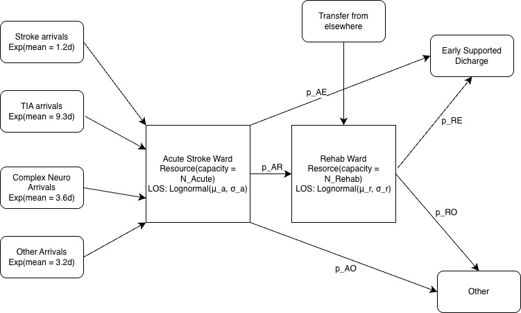

# HDPM_097 Discrete Event Simulation Project

Authors:  NA, NB, LB

## Abstract

(Write this last)

## Introduction

The aim of this study was to test if it is possible to recreate a simulation model described in an academic journal using Python and the simulation library `SimPy`.

## Methods

## 1. Selection of published model

We analysed 4 candidate articles. These are:
-  **Penn et al. (2019)** — *Towards generic modelling of hospital wards: Reuse and redevelopment of simple models*
-  **Lahr et al. (2013)** — *A Simulation-based Approach for Improving Utilization of Thrombolysis in Acute Brain Infarction*
-  **Griffiths et al. (2010)** — *A simulation model of bed-occupancy in a critical care unit*
-  **Monks et al. (2016)** — *A modelling tool for capacity planning in acute and community stroke services*

We compared these articles, considering:
-   **Model structure** — How clearly is the model logic described
-   **Data completeness** — Are distribution types and parameters fully reported?
-   **SimPy feasibility** — How naturally does the model map to SimPy constructs such as resources, queues and processes?
-   **Validation opportunity** — Are there reported outputs to validate a recreation against?
-   **Simplification scope** — Can the model be reasonably simplified, if necessary, while meeting the assignment's minimum complexity requirement?

The group agreed to proceed with the **Monks et al. (2016)** paper. The rationale for selection was that this study offered a clear model structure and pathway logic, and sufficient reporting of parameters and process flow.

Monks et al describe a discrete-event simulation model using aggregate parameter values derived from data on over 2000 anonymised admission and discharge timestamps. The model mimicked the flow of stroke, high risk TIA and complex neurological patients from admission to an acute ward through to community rehab and early supported discharge, and predicted the probability of admission delays.

## 2. Activities, resources and routing.

The model mimics the flow of patients from admission to an acute stroke unit, through to rehab and discharge.

## 2.1 Entities

The model contains one entity type:
- **Patient**

Patients are categorised into four subtypes:
- Stroke
- TIA
- Complex Neurological
- Other

Each subtype has distinct inter-arrival distribition, length of stay distribution, and transfer possibilities.

## 2.2 Activities

In discrete event simulation (DES), activities are processes that consume time.

### Activity 1 - Arrival at acute stoke unit
- inter-arrival times (IAT): exponential
- seperate IATs for each patient group:
  - Acute stroke, 1.2 days
  - TIA, 9.3 days
  - complex neuro, 3.6 days
  - other, 3.2 days

### Activity 2 - Acute ward stay
- Duration: Lognormal distribution
- parameters differ by patient type:
  - Acute stroke, no ESD: 7.4 days
  - Acute stroke, ESD: 4.6 days
  - stroke mortality: 7.0 days
  - TIA: 1.8 days
  - Complex neuro: 4.0 days
  - Other: 3.8 days

### Activity 3 - rehab ward stay (if routed)
- Duration: Lognormal distribution
- parameters from table S2

## 2.3 Resources

- Acute stroke beds: 10 beds
- Rehab beds: 12 beds

## 2.4 Routing Logic

After completion of acute ward stay, patients are routed probabilistically according to the transfer matrix (appendix: table S3):
- Acute -> Rehab unit
- Acute -> Early Supported Discharge (ESD)
- Acute -> Other (for example, own home, care home, or death)

From Rehab:
- Rehab -> ESD
- Rehab -> Other

This routing is implemented using multinomial sampling.

Together, these observations provide the parameters for the simulation model.

Note that in the study, a warm up period of 3 years was used. Each model runs for 5 years. Each scenario was replicated 150 times. 5 scenarios were used for capacity planning

## 3. Iterative development of the model using LLM

(description)

## 4. Validation and testing

(description)

## Results

## Discussion

## Conclusions

## References
